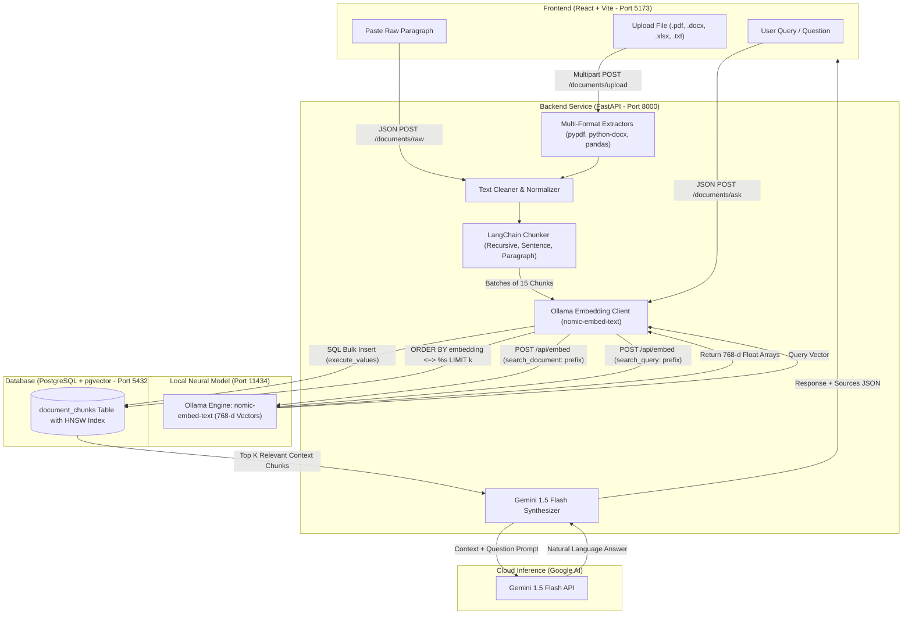

# End-to-End System Documentation: VectorDB & RAG Experiment

This document provides a comprehensive, deep-dive explanation of the entire **VectorDB & Retrieval-Augmented Generation (RAG)** system—covering setup, internal architecture, frontend-backend connectivity, multi-format document extraction, text chunking strategies, dense vector embeddings, database indexing, mathematical similarity metrics, and LLM answer synthesis.

---

## Table of Contents
1. [System Overview & High-Level Architecture](#1-system-overview--high-level-architecture)
2. [Quickstart & Running the Application](#2-quickstart--running-the-application)
3. [Frontend-to-Backend Connectivity & Communication](#3-frontend-to-backend-connectivity--communication)
4. [Document Extraction & Data Ingestion](#4-document-extraction--data-ingestion)
5. [Text Chunking & Sliding Window Overlap](#5-text-chunking--sliding-window-overlap)
6. [Dense Vector Embeddings (Ollama nomic-embed-text)](#6-dense-vector-embeddings-ollama-nomic-embed-text)
7. [PostgreSQL & pgvector Search Engine](#7-postgresql--pgvector-search-engine)
8. [RAG Pipeline: Transforming Data into Human-Friendly Answers](#8-rag-pipeline-transforming-data-into-human-friendly-answers)
9. [Complete API Reference & Data Contracts](#9-complete-api-reference--data-contracts)
10. [Troubleshooting & Gotchas](#10-troubleshooting--gotchas)

---

## 1. System Overview & High-Level Architecture

The project solves the fundamental limitation of traditional keyword search (such as SQL `LIKE` or regex), which fails when search queries do not share the exact vocabulary as the source text. 

Instead of matching strings, this system maps the **semantic meaning** of text into a high-dimensional mathematical space (768 dimensions). When a user queries the system, it finds conceptually related passages—even with completely distinct wording—and uses an LLM to synthesize a natural, coherent response.


### Architectural Flowchart (ASCII & Mermaid)

```text
┌────────────────────────────────────────────────────────────────────────┐
│                   1. FRONTEND UI (React + Vite - Port 5173)            │
│                                                                        │
│   [ Upload File (.pdf, .docx, .xlsx, .txt) ]   [ Paste Raw Paragraph ] │
│                         │                                  │           │
│                         ▼                                  ▼           │
│               POST /documents/upload              POST /documents/raw  │
└─────────────────────────┬──────────────────────────────────┬───────────┘
                          │                                  │
                          ▼                                  ▼
┌────────────────────────────────────────────────────────────────────────┐
│             2. BACKEND INGESTION PIPELINE (FastAPI - Port 8000)        │
│                                                                        │
│   a. File Extraction (pypdf, python-docx, pandas, openpyxl)            │
│                            │                                           │
│                            ▼                                           │
│   b. Text Cleaner & Normalizer (strips unprintable & whitespace)       │
│                            │                                           │
│                            ▼                                           │
│   c. Recursive Chunker (Splits into 800-char chunks with 150 overlap)  │
│                            │                                           │
│                            ▼                                           │
│   d. Batch Embedder (Safe batches of 15 chunks with live progress)     │
└────────────────────────────┬───────────────────────────────────────────┘
                             │
                             ▼ POST /api/embed (prefix: 'search_document:')
┌────────────────────────────────────────────────────────────────────────┐
│             3. OLLAMA LOCAL NEURAL MODEL (Port 11434)                  │
│                                                                        │
│     Model: nomic-embed-text  ──► Generates 768-dimensional float array │
└────────────────────────────┬───────────────────────────────────────────┘
                             │
                             ▼ Bulk SQL INSERT (execute_values)
┌────────────────────────────────────────────────────────────────────────┐
│             4. POSTGRESQL + PGVECTOR DATABASE (Port 5432)              │
│                                                                        │
│     Table: document_chunks [ id, doc_id, file_name, content, vector ]  │
│     Index: HNSW Graph Index (vector_cosine_ops, l2_ops, ip_ops)        │
└────────────────────────────┬───────────────────────────────────────────┘
                             ▲
                             │ ORDER BY embedding <=> %s LIMIT k
                             │ (Cosine / Euclidean / Dot product match)
┌────────────────────────────┴───────────────────────────────────────────┐
│             5. RAG QUERY & ANSWER SYNTHESIS                            │
│                                                                        │
│   User Question ──► Ollama (search_query:) ──► pgvector Top-K Chunks   │
│                                                     │                  │
│                                                     ▼                  │
│   Retrieved Context Chunks + Question injected into Prompt Template    │
│                                                     │                  │
│                                                     ▼                  │
│   Google Gemini 1.5 Flash ───────────────────► Natural Language Answer  │
└────────────────────────────────────────────────────────────────────────┘
```

#### Mermaid Code (For IDE Preview / GitHub):



---

## 2. Quickstart & Running the Application

### Prerequisites

1. **PostgreSQL with `pgvector` Extension**
   - Ensure PostgreSQL is installed and listening on port `5432`.
   - Run the following in PostgreSQL (`psql` or pgAdmin):
     ```sql
     CREATE EXTENSION IF NOT EXISTS vector;
     ```
2. **Ollama (Local Embedding Model)**
   - Download and run Ollama from [ollama.com](https://ollama.com).
   - Start the service:
     ```bash
     ollama serve
     ```
   - Pull the required 768-dimensional model:
     ```bash
     ollama pull nomic-embed-text
     ```
3. **Google Gemini API Key**
   - Obtain a free API key from [Google AI Studio](https://aistudio.google.com/app/apikey).

---

### Step 1: Start the Backend (BE)

```bash
cd BE

# 1. Create and activate virtual environment
python3 -m venv venv
source venv/bin/activate

# 2. Install dependencies
pip install -r requirements.txt

# 3. Create .env file
cp .env.example .env
```

Ensure your `BE/.env` matches your environment:
```env
GEMINI_API_KEY=your_gemini_api_key_here
POSTGRES_HOST=localhost
POSTGRES_PORT=5432
POSTGRES_DB=postgres
POSTGRES_USER=postgres
POSTGRES_PASSWORD=postgres
PG_TABLE_NAME=document_chunks
OLLAMA_BASE_URL=http://localhost:11434
EMBEDDING_MODEL=nomic-embed-text
```

Start the FastAPI application:
```bash
uvicorn main:app --reload --port 8000
```
- **Backend API:** `http://localhost:8000`
- **Interactive Swagger Documentation:** `http://localhost:8000/docs`

---

### Step 2: Start the Frontend (FE)

In a separate terminal window:
```bash
cd FE

# 1. Install dependencies
npm install

# 2. Run Vite local development server
npm run dev
```
- **Web Interface:** `http://localhost:5173`

---

## 3. Frontend-to-Backend Connectivity & Communication

The frontend and backend interact via asynchronous REST endpoints over HTTP:

### 1. Host & Port Configuration
- **Frontend:** Runs via Vite on `http://localhost:5173`.
- **Backend:** Runs via Uvicorn on `http://localhost:8000`.
- In `FE/src/App.jsx`, API routes are prefixed by:
  ```javascript
  const API_BASE = "http://localhost:8000/documents";
  ```

### 2. Cross-Origin Resource Sharing (CORS)
To prevent web browser security blocks from cross-origin requests, `BE/main.py` explicitly whitelists Vite origins:
```python
app.add_middleware(
    CORSMiddleware,
    allow_origins=[
        "http://localhost:3000",
        "http://localhost:5173",
        "http://127.0.0.1:3000",
        "http://127.0.0.1:5173"
    ],
    allow_credentials=True,
    allow_methods=["*"],
    allow_headers=["*"],
)
```

### 3. Asynchronous Real-Time Polling Pattern
When uploading large documents (like PDFs with multiple pages), parsing and embedding cannot be executed inside a single synchronous HTTP request without causing gateway timeouts.

Instead, the system utilizes an **Async Job + Polling** pattern:
1. `FE` sends `POST /documents/upload`.
2. `BE` queues `process_file_background` in FastAPI's `BackgroundTasks` and returns immediately with a unique `task_id` (`HTTP 200`).
3. `FE` enters an asynchronous loop polling `GET /documents/tasks/{task_id}` every 1000ms.
4. `BE` worker updates its progress stages in an in-memory dictionary:
   - `PROCESSING`: `"Extracting text from document.pdf..."`
   - `PROCESSING`: `"Extracted 12 pages. Chunking with 'recursive' strategy..."`
   - `PROCESSING`: `"Embedding and saving chunks: 15/45 complete..."`
   - `COMPLETED`: `"Successfully chunked and embedded 45 chunks in pgvector."`
   - *(or `FAILED` with explicit error detail).*
5. `FE` renders live progress banners and automatically transitions to **Step 2 (Ask Question)** upon completion.

---

## 4. Document Extraction & Data Ingestion

The ingestion engine is modularized under `BE/app/extractors/`. The entrypoint `factory.py` inspects the file extension and routes bytes to the appropriate handler:

### 1. Supported File Formats
- **PDF (`.pdf`):** Handled by `pdf.py` using `pypdf.PdfReader`. Extracts text page-by-page and records metadata (`page_number`, `total_pages`).
- **Word (`.docx`):** Handled by `docx.py` using `python-docx`. Extracts paragraph text and table cell data.
- **Excel & CSV (`.xlsx`, `.xls`, `.csv`):** Handled by `excel.py` using `pandas` and `openpyxl`. Reads tabular worksheets and serializes rows into key-value context blocks.
- **Plain Text & Markdown (`.txt`, `.md`):** Handled by `txt.py` using UTF-8 decoding with fallback error handling.
- **Direct Paragraph Input:** Handled via `POST /documents/raw`. Bypasses file storage completely and feeds directly into the cleaner and chunker.

### 2. Text Normalization (`cleaner.py`)
Extracted raw text often contains unprintable characters, formatting garbage, or inconsistent whitespace. Before chunking, `clean_text` executes:
- Replacement of non-breaking spaces (`\xa0`) and special Unicode blanks.
- Normalization of multiple consecutive spaces into single spaces.
- Collapse of three or more consecutive line breaks (`\n\n\n+`) into double line breaks (`\n\n`).
- Stripping of leading and trailing whitespace.

---

## 5. Text Chunking & Sliding Window Overlap

Embedding models have finite context windows (e.g., 2048 tokens). Storing an entire 50-page document as a single vector causes catastrophic context loss. Chunking breaks documents into coherent passages.

Implemented in `BE/app/processing/chunker.py`:

### Supported Chunking Strategies

| Strategy | Split Mechanism | Best Used For |
|---|---|---|
| **Recursive** *(Recommended)* | Splits hierarchically using `["\n\n", "\n", ". ", " ", ""]` | General documents, technical papers, narrative text |
| **Paragraph** | Splits strictly on double line breaks (`\n\n`) | Well-structured articles with distinct topical paragraphs |
| **Sentence** | Splits strictly on sentence boundaries (`. `) | Fact-checking, legal contracts, granular clause analysis |
| **Fixed** | Splits on hard character boundaries | Fixed-memory low-level benchmarks |

### The Power of Sliding Window Overlap (`chunk_overlap=150`)
When a text boundary splits an important idea, semantic meaning can be severed:
- *Without Overlap:* Chunk 1 ends with `"The policy does not apply to..."` and Chunk 2 begins with `"customers who purchased after June 1st."`
- *With Overlap (150 chars):* The trailing 150 characters of Chunk 1 are prepended to Chunk 2, ensuring critical context across chunk boundaries is preserved.

---

## 6. Dense Vector Embeddings (Ollama nomic-embed-text)

Handled in `BE/app/database/embeddings.py`.

### 1. What are Vector Embeddings?
An embedding model converts a text string into an array of floating-point numbers representing coordinates in a high-dimensional semantic space. In this project, `nomic-embed-text` produces **768-dimensional float vectors**.

Texts with similar meanings end up mathematically close to each other in this 768-dimensional space, even if their words differ entirely:
- `"automobile repair cost"` $\approx$ `"car maintenance price"`

### 2. Task Prefixes (Asymmetric Embeddings)
`nomic-embed-text` is an asymmetric embedding model trained with task prefixes to distinguish between passages and search queries:
- **For Document Chunks:** The prefix `search_document: ` is prepended to the text before embedding.
- **For User Queries:** The prefix `search_query: ` is prepended to the query before embedding.

### 3. Chunk Batching (Batches of 15)
To prevent timeouts when embedding 50+ chunks from a PDF, `vector_store.py` divides chunks into batches of 15. Each batch is embedded and saved incrementally, triggering progress updates for the frontend UI.

---

## 7. PostgreSQL & pgvector Search Engine

Handled in `BE/app/database/vector_store.py`.

### 1. Database Schema
On startup, `init_db()` verifies that the `vector` extension is active and ensures the table exists:
```sql
CREATE EXTENSION IF NOT EXISTS vector;

CREATE TABLE IF NOT EXISTS document_chunks (
    id BIGSERIAL PRIMARY KEY,
    doc_id VARCHAR(64) NOT NULL,
    file_name VARCHAR(255) NOT NULL,
    chunk_index INTEGER NOT NULL,
    content TEXT NOT NULL,
    metadata JSONB DEFAULT '{}'::jsonb,
    embedding vector(768) NOT NULL,
    created_at TIMESTAMP WITH TIME ZONE DEFAULT CURRENT_TIMESTAMP
);
```

### 2. HNSW Indexing (Hierarchical Navigable Small World)
Without an index, finding the nearest neighbors requires a sequential scan through every row (slow $O(N)$ computation). 

The system creates an **HNSW graph index** across the embeddings. HNSW allows approximate nearest neighbor (ANN) retrieval in $O(\log N)$ time with $>99\%$ recall accuracy:
```sql
CREATE INDEX IF NOT EXISTS document_chunks_embedding_hnsw_idx 
ON document_chunks USING hnsw (embedding vector_cosine_ops);

CREATE INDEX IF NOT EXISTS document_chunks_embedding_hnsw_l2_idx 
ON document_chunks USING hnsw (embedding vector_l2_ops);

CREATE INDEX IF NOT EXISTS document_chunks_embedding_hnsw_ip_idx 
ON document_chunks USING hnsw (embedding vector_ip_ops);
```

### 3. Switchable Distance Metrics (Mathematical Formulas)
The system allows dynamic benchmarking between 3 distance formulas:

| Formula Name | SQL Operator | Math Representation | When to Choose |
|---|:---:|:---:|---|
| **Cosine Distance** | `<=>` | $1 - \frac{u \cdot v}{\|u\| \|v\|}$ | **Default.** Best for text embeddings where direction matters more than text length. |
| **Euclidean / L2 Distance** | `<->` | $\sqrt{\sum (u_i - v_i)^2}$ | Geometric straight-line distance; sensitive to vector magnitude. |
| **Negative Inner Product** | `<#>` | $-(u \cdot v)$ | Dot product; ideal for normalized vectors (fastest calculation). |

**SQL Query Executed at Runtime:**
```sql
SELECT id, doc_id, file_name, chunk_index, content, metadata,
       (embedding <=> %s::vector) AS distance_score
FROM document_chunks
ORDER BY embedding <=> %s::vector
LIMIT 5;
```

---

## 8. RAG Pipeline: Transforming Data into Human-Friendly Answers

Handled in `BE/app/processing/generator.py`.

Once the database identifies the top-$k$ most similar chunks, raw database records must be synthesized into a coherent answer.

### 1. Context Assembly
The content of each retrieved chunk is joined using markdown separators:
```python
context_text = "\n\n---\n\n".join([chunk["content"] for chunk in retrieved_chunks])
```

### 2. Prompt Engineering & Guardrails
The retrieved context and user query are injected into an LLM prompt template:
```text
You are a helpful assistant. Use the following pieces of retrieved context to answer the question.
If you don't know the answer based on the context, just say that you don't know. Do not try to make up an answer.
Keep the answer clear and concise.

Context:
{context}

Question: {question}

Answer:
```

### 3. Generation via Gemini 1.5 Flash
The formatted prompt is invoked via LangChain's `ChatGoogleGenerativeAI` (`model="gemini-1.5-flash"`). 
- If the question asks for a synthesis (e.g. *"What is the return window for electronics?"*), the LLM reads the extracted chunks, finds the policy clause, and outputs an articulate answer.
- The backend packages the answer alongside the source chunks, cosine distance scores, and applied formula, and returns it to the UI.

---

## 9. Complete API Reference & Data Contracts

### 1. Upload Document
- **Endpoint:** `POST /documents/upload`
- **Content-Type:** `multipart/form-data`
- **Parameters:**
  - `file`: Binary file (`.pdf`, `.docx`, `.xlsx`, `.txt`, `.md`)
  - `strategy`: Chunking strategy (`recursive`, `fixed`, `sentence`, `paragraph`)
  - `chunk_size`: Max chunk characters (Default: `800`)
  - `chunk_overlap`: Overlapping characters (Default: `150`)
  - `embedding_model`: Model name (Default: `nomic-embed-text`)
- **Response (`200 OK`):**
  ```json
  {
    "message": "File upload accepted. Processing and embedding in background.",
    "task_id": "9b1deb4d-3b7d-4bad-9bdd-2b0d7b3dcb6d",
    "doc_id": "doc_e2b10a48b9",
    "filename": "warranty_policy.pdf",
    "embedding_model": "nomic-embed-text"
  }
  ```

---

### 2. Ingest Raw Paragraph
- **Endpoint:** `POST /documents/raw`
- **Content-Type:** `application/json`
- **Request Body:**
  ```json
  {
    "text": "Customers can request a refund within 30 days of purchase.",
    "title": "Refund Clause",
    "strategy": "recursive",
    "chunk_size": 800,
    "chunk_overlap": 150,
    "embedding_model": "nomic-embed-text"
  }
  ```
- **Response (`200 OK`):**
  ```json
  {
    "message": "Paragraph successfully chunked, embedded, and stored in PostgreSQL (pgvector).",
    "doc_id": "snippet_87a82c6104",
    "title": "Refund Clause",
    "chunks_created": 1,
    "strategy": "recursive",
    "embedding_model": "nomic-embed-text"
  }
  ```

---

### 3. Check Task Progress
- **Endpoint:** `GET /documents/tasks/{task_id}`
- **Response (`200 OK` - While Running):**
  ```json
  {
    "status": "PROCESSING",
    "details": {
      "doc_id": "doc_e2b10a48b9",
      "filename": "warranty_policy.pdf",
      "message": "Embedding and saving chunks: 15/30 complete..."
    }
  }
  ```
- **Response (`200 OK` - When Complete):**
  ```json
  {
    "status": "COMPLETED",
    "details": {
      "doc_id": "doc_e2b10a48b9",
      "filename": "warranty_policy.pdf",
      "chunks_created": 30,
      "strategy": "recursive",
      "embedding_model": "nomic-embed-text",
      "message": "Successfully chunked and embedded 30 chunks in PostgreSQL (pgvector)."
    }
  }
  ```

---

### 4. Ask Question (RAG Synthesis)
- **Endpoint:** `POST /documents/ask`
- **Content-Type:** `application/json`
- **Request Body:**
  ```json
  {
    "query": "How many days do I have to return an iPhone?",
    "top_k": 3,
    "distance_metric": "cosine",
    "embedding_model": "nomic-embed-text"
  }
  ```
- **Response (`200 OK`):**
  ```json
  {
    "query": "How many days do I have to return an iPhone?",
    "embedding_model": "nomic-embed-text",
    "distance_metric": "cosine",
    "answer": "According to the electronics policy, smartphones such as iPhones have a strict 14-day return window from delivery date.",
    "context_chunks_used": 3,
    "sources": [
      {
        "content": "Laptops, smartphones, audio equipment... have a strict 14-day return window.",
        "distance_score": 0.1824,
        "distance_metric": "cosine",
        "metadata": {
          "file_name": "warranty_policy.pdf",
          "page_number": 1
        }
      }
    ]
  }
  ```

---

### 5. Semantic Search (Raw Vector Similarity)
- **Endpoint:** `POST /documents/query`
- **Content-Type:** `application/json`
- **Request Body:**
  ```json
  {
    "query": "store credit expiration",
    "top_k": 2,
    "distance_metric": "l2",
    "embedding_model": "nomic-embed-text"
  }
  ```
- **Response (`200 OK`):**
  ```json
  {
    "query": "store credit expiration",
    "embedding_model": "nomic-embed-text",
    "distance_metric": "l2",
    "results_count": 2,
    "results": [
      {
        "content": "Items returned after 30 days but within 60 days receive store credit...",
        "distance_score": 0.4215,
        "distance_metric": "l2",
        "metadata": { "file_name": "warranty_policy.pdf" }
      }
    ]
  }
  ```

---

### 6. Document Management
- **List All Documents:** `GET /documents`
  - Returns distinct document IDs, filenames, chunk counts, and ingestion dates.
- **Delete Document:** `DELETE /documents/{doc_id}`
  - Deletes all associated vector rows from PostgreSQL for that document ID.

---

## 10. Troubleshooting & Gotchas

### 1. Scanned Image PDFs
- **Issue:** File uploads, but returns `"No printable text found. The file may be an image-only/scanned document."`
- **Cause:** Standard PDF libraries (`pypdf`) extract text layers. Scanned PDFs are images with no selectable text.
- **Solution:** Use a digital/searchable PDF or convert it using an OCR tool before uploading.

### 2. Ollama Connection Refused
- **Issue:** Backend reports `Could not connect to Ollama at 'http://localhost:11434'`.
- **Cause:** The Ollama daemon is not running.
- **Solution:** Run `ollama serve` or open the Ollama desktop app, and verify `ollama list` shows `nomic-embed-text`.

### 3. Vector Dimension Mismatch
- **Issue:** Database throws `column "embedding" has different vector dimensions (384 and 768)`.
- **Cause:** The PostgreSQL column is configured as `vector(768)`. Attempting to embed with a 384-dimensional model (like `all-minilm`) into the same column will fail.
- **Solution:** Maintain `nomic-embed-text` (768 dimensions) or drop/recreate the table for models with different dimensionalities.

### 4. Gemini API Rate Limits (HTTP 429 / 503)
- **Issue:** Generation intermittently reports high demand or rate limits.
- **Cause:** Gemini Free tier requests per minute threshold.
- **Solution:** The backend automatically retries requests with exponential backoff.
